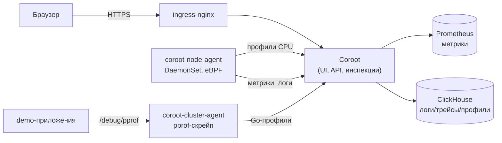

# Coroot: непрерывное профилирование в Yandex Managed K8s — находим узкие места по флеймграфам

## Введение

Классический мониторинг отвечает на вопрос «*что* сломалось»: метрики показывают рост CPU, логи — стек ошибок, трейсы — медленный сервис. Но когда нужно ответить «*почему* именно этот сервис стал медленным», почти все инструменты пасуют. Вы видите, что контейнер потребляет 2 ядра CPU, но не видите, какая строка кода их загружает. Начинается классический процесс: локально прогнать `pprof`/`py-spy`/`async-profiler`, попытаться воспроизвести нагрузку, угадать тестовые данные.

[Coroot](https://github.com/coroot/coroot) — open-source платформа наблюдаемости (Apache-2.0), которая превращает telemetry-сигналы в actionable insights. Её ключевая особенность — **непрерывное профилирование из коробки**: eBPF-профилировщик снимает CPU-профили всех процессов на ноде без единой строки кода в приложении, а языковые профилировщики (Go, Java) добавляют память и блокировки. Результат — флеймграф до точной строки кода в один клик, плюс предустановленные инспекции, которые автоматически находят типовые проблемы (утечки памяти, лишние аллокации, блокировки).

В этой статье мы развернём Coroot в Yandex Managed Kubernetes через официальный coroot-operator (Community Edition), ограничим хранение данных одним часом, а затем задеплоим три намеренно «сломанных» приложения — на Nuxt (Node.js), Python и Go — и посмотрим, как их проблемы всплывают в профилировании.

## Coroot vs Pyroscope vs Parca vs Datadog Continuous Profiler

| Метрика | Coroot | Grafana Pyroscope | Parca | Datadog |
|---------|--------|-------------------|-------|---------|
| Профилирование | eBPF CPU + Go (heap/pprof) + Java (async-profiler) | pprof/ebpf-клиенты, языковые агенты | eBPF + pprof | SaaS, eBPF + агенты |
| Нужны ли изменения кода | Нет (eBPF), для Go-памяти/CPU — опционально pprof | Для части языков нужен клиент | Нет (eBPF) | Агент |
| Метрики + логи + трейсы | ✅ в одном UI | ❌ (только профили) | ❌ (только профили) | ✅ |
| Автодиагностика (инспекции) | ✅ 80%+ типовых проблем | ❌ | ❌ | ⚠️ |
| SLO-алертинг | ✅ | ❌ | ❌ | ✅ |
| Service Map | ✅ | ❌ | ❌ | ✅ |
| Хранилище профилей | ClickHouse | S3-совместимое | object storage | проприетарное |
| Self-hosted | ✅ | ✅ | ✅ | ❌ |
| Лицензия | Apache-2.0 | AGPL-3.0 | Apache-2.0 | проприетарная |

Coroot не пытается быть «ещё одним pprof-интерфейсом» — профили здесь один из сигналов наравне с метриками, логами и трейсами, и все они связаны между собой: от аномалии на графике CPU — в флеймграф, от фрейма — в связанные логи и трейсы.

Отличительные особенности Coroot:

- **Zero-instrumentation** — eBPF снимает CPU-профили всех процессов на ноде без изменений в коде
- **Языковые профилировщики** — Go (heap + pprof: CPU/blocking/mutex), Java (async-profiler: CPU/alloc/lock)
- **Инспекции** — предустановленные проверки аудитируют каждое приложение и находят ~80% типовых проблем без настройки
- **Просмотр в один клик** — флеймграф, сравнение с базовой линией, drill в логи и трейсы

> Предполагается, что у вас уже есть Yandex Managed Kubernetes и настроен `yc` CLI.

## Часть 1. Разворачиваем Coroot в Yandex Managed K8s

### Архитектура

Coroot в кластере состоит из нескольких компонентов, которые разворачивает **coroot-operator**:

- **coroot** — сам сервер (StatefulSet, 1 реплика): UI, API, инспекции, RCA
- **coroot-node-agent** — DaemonSet на каждой ноде: eBPF CPU-профилировщик, метрики, логи, трейсы
- **coroot-cluster-agent** — Deployment: кластерная телеметрия + pprof-скрейп Go-приложений
- **Prometheus** — хранилище метрик (remote-write receiver включён)
- **ClickHouse** — хранилище логов, трейсов и профилей (+ clickhouse-keeper для координации)



### Шаг 1. Инфраструктура: Terraform

Как и в проекте с OpenObserve, кластер поднимается Terraform'ом. Сеть — 3 приватные подсети (по одной в зоне `ru-central1-b/d/e`), ноды без публичных IP, исходящий трафик через NAT-шлюз.

```bash
terraform init
terraform apply \
  -var="folder_id=<ваш-folder-id>" \
  -var="coroot_admin_password=<пароль-админа>"
```

Что создаёт Terraform (`net.tf`, `ip-dns.tf`, `k8s.tf`, `coroot.tf`):

- VPC + 3 приватные подсети + NAT-шлюз + route table
- Публичный IP для балансировщика ingress-nginx (FQDN `coroot.<ip>.sslip.io` формируется автоматически)
- Managed K8s (v1.33, 3 ноды 2 vCPU / 4 GB) + ingress-nginx через Helm
- Helm-релизы `coroot-operator` и `coroot` (coroot-ce) в namespace `coroot`

### Шаг 2. Coroot CR и retention 1 час

Helm-чарт `coroot-ce` рендерит Custom Resource `Coroot`, которым управляет оператор. Ключевая часть конфигурации в `coroot.tf`:

```yaml
metricsRefreshInterval: "15s"

# Retention: все данные Coroot хранятся не дольше 1 часа
cacheTTL: "1h"      # TTL метрического кэша Coroot
tracesTTL: "1h"     # TTL таблиц трейсов в ClickHouse
logsTTL: "1h"       # TTL таблиц логов в ClickHouse
profilesTTL: "1h"   # TTL таблиц профилей в ClickHouse

authBootstrapAdminPasswordSecret:
  name: coroot-admin-secret
  key: admin-password

ingress:
  className: nginx
  host: coroot.<ip>.sslip.io
  path: /

clickhouse:
  shards: 1
  replicas: 1
  keeper:
    replicas: 1
  storage:
    size: "20Gi"

prometheus:
  retention: "1h"
  storage:
    size: "10Gi"

storage:
  size: "10Gi"
```

Что здесь важно:

- **Retention ограничен 1 часом** в трёх местах: TTL таблиц ClickHouse (`logsTTL`/`tracesTTL`/`profilesTTL`), метрический кэш (`cacheTTL`) и retention встроенного Prometheus (`prometheus.retention: "1h"`). TTL применяются при создании таблиц; для уже существующих таблиц их нужно поправить через `ALTER TABLE ... MODIFY TTL`.
- **Пароль администратора** живёт только в Kubernetes Secret `coroot-admin-secret`, а в CR передаётся ссылка на него (`authBootstrapAdminPasswordSecret`) — в git и в Helm-release пароля нет.
- **Keeper — 1 реплика** вместо 3 по умолчанию: для демо-кластера из 3 нод это разумный компромисс (3 реплики keeper'а съели бы всю ноду).

### Шаг 3. Проверяем

```bash
# Креды для kubectl
eval "$(terraform output -raw k8s_cluster_credentials_command)"

# Ждём готовности подов
kubectl get pods -n coroot -w
```

Должно получиться примерно так:

```
NAME                                 READY   STATUS    RESTARTS   AGE
coroot-coroot-0                      1/1     Running   0          5m
coroot-clickhouse-0                  1/1     Running   0          5m
coroot-clickhouse-keeper-0           1/1     Running   0          5m
coroot-prometheus-xxx-yyy            1/1     Running   0          5m
coroot-node-agent-abc12              1/1     Running   0          5m
coroot-node-agent-def34              1/1     Running   0          5m
coroot-node-agent-ghi56              1/1     Running   0          5m
coroot-cluster-agent-xxx-yyy         1/1     Running   0          5m
coroot-operator-xxx-yyy              1/1     Running   0          5m
```

Открываем UI:

```bash
open "http://$(terraform output -raw coroot_fqdn)"
```

Входим с паролем администратора (`coroot_admin_password`). На первой странице Coroot предложит создать проект — выбираем «Kubernetes» и оставляем всё по умолчанию: оператор уже сконфигурировал Prometheus и ClickHouse.

## Часть 2. Три «сломанных» приложения

Чтобы продемонстрировать профилирование, задеплоим три приложения с намеренно внесёнными проблемами. Исходники и манифесты — в каталоге `apps/`.

Образы собираются локально и загружаются в кластер (`imagePullPolicy: IfNotPresent`, образы `demo-*:latest`). Перед деплоем соберите их (например, через `docker build` + `docker save`/`ctr images import` на нодах, либо свой приватный registry):

```bash
cd apps/golang && docker build -t demo-golang:latest . && cd ../python && docker build -t demo-python:latest . && cd ../nuxt && docker build -t demo-nuxt:latest .
```

### Демо 1: Nuxt (Node.js) — CPU-bound

Приложение на Nuxt 3 с единственным API-эндпоинтом `/api/cpu`, который считает наивный Фибоначчи (`fib(35)` — ~18 млн рекурсивных вызовов). Экспоненциальная сложность мгновенно видна в CPU-профиле.

Ключевой момент — **символизация JS-фреймов**. eBPF-профилировщик снимает нативные стектрейсы, но без perf-map названия JS-функций не резолвятся. Node.js умеет генерировать perf-map сам, если запустить его с флагами:

```yaml
env:
  - name: NODE_OPTIONS
    value: "--perf-basic-prof-only-functions --interpreted-frames-native-stack"
```

С этими флагами во флеймграфе будут реальные имена функций `fib`/`fib`, а не анонимные адреса.

```bash
kubectl apply -f apps/nuxt/deploy.yaml
kubectl run -n demo load --image=curlimages/curl --rm -it -- \
  sh -c 'while true; do curl -s http://demo-nuxt:3000/api/cpu > /dev/null; done'
```

### Демо 2: Python — CPU-bound

Python-приложение на стандартном `http.server` с эндпоинтом `/cpu`: наивный `fib(30)` плюс busy-loop с `math.sqrt`. eBPF-профилировщик Coroot снимает CPU-профиль Python-процесса без каких-либо агентов и изменений кода.

```bash
kubectl apply -f apps/python/deploy.yaml
kubectl run -n demo load-python --image=curlimages/curl --rm -it -- \
  sh -c 'while true; do curl -s http://demo-python:8080/cpu > /dev/null; done'
```

### Демо 3: Go — утечка памяти и горутин

Go-приложение с тремя проблемами сразу:

- **утечка памяти** — фоновый цикл каждые 500 мс добавляет 1 MiB в слайс, который никогда не освобождается
- **утечка горутин** — эндпоинт `/leak` запускает горутину, которая блокируется навсегда
- **CPU-нагрузка** — эндпоинт `/cpu` с бесполезным циклом на 5 млн итераций

Для Go Coroot использует **два комплементарных механизма**: автоматический heap-профилинг через `coroot-node-agent` (читает `runtime.MemProfile` из `/proc/<pid>/mem`, без изменений в коде) и pprof-скрейп через `coroot-cluster-agent`. Чтобы включить pprof-скрейп (CPU/blocking/mutex), нужно экспортировать `/debug/pprof` и аннотировать под:

```yaml
template:
  metadata:
    annotations:
      coroot.com/profile-scrape: "true"
      coroot.com/profile-port: "8080"
```

Сам код подключает `net/http/pprof` одной строкой:

```go
import _ "net/http/pprof"
```

```bash
kubectl apply -f apps/golang/deploy.yaml
kubectl run -n demo load-go --image=curlimages/curl --rm -it -- \
  sh -c 'while true; do curl -s http://demo-golang:8080/leak > /dev/null; done'
```

## Часть 3. Что видно в Coroot

### Флеймграф CPU (Python / Node.js)

Открываем приложение `demo-python` → вкладка **Profiling**. Агрегированный флеймграф за выбранный интервал покажет, что почти всё CPU уходит в `naive_fib` — рекурсию с экспоненциальной сложностью. То же для `demo-nuxt`, где благодаря perf-map виден именно `fib` в JS.

Режим **Comparison** подсветит красным функции, которые стали есть больше CPU относительно прошлого интервала — удобно ловить регрессии после релиза.

### Memory-профиль (Go)

У приложения `demo-golang` вкладка **Memory** покажет устойчивый рост `alloc_space`: куча растёт на ~2 MiB/сек за счёт фонового `growLeak`. Флеймграф memory-профиля укажет точное место — `main.growLeak`, где происходит `append` в `leakBuf`.

Горутины-утечки видны косвенно: число горутин растёт (`/healthz` отдаёт `runtime.NumGoroutine()`), а Coroot свяжет это с ростом потребления и деградацией SLO.

### Инспекции

Помимо профилей, предустановленные инспекции Coroot автоматически подсветят проблемы: постоянный рост потребления памяти, высокую утилизацию CPU одним подом, отсутствие лимитов и т.д. Инспекции — это и есть «встроенная экспертиза», которая находит типовые проблемы без ручной настройки дашбордов.

## Ограничение хранения 1 часом

Хранение ограничено одним часом во всех слоях:

| Слой | Параметр | Значение |
|------|----------|----------|
| Логи (ClickHouse) | `logsTTL` | `1h` |
| Трейсы (ClickHouse) | `tracesTTL` | `1h` |
| Профили (ClickHouse) | `profilesTTL` | `1h` |
| Метрический кэш Coroot | `cacheTTL` | `1h` |
| Метрики (Prometheus) | `prometheus.retention` | `1h` |

> **Почему не VictoriaMetrics.** У single-node VictoriaMetrics минимальный `-retentionPeriod` — **24h** (меньше задать нельзя: VM не стартует). Поэтому в этой конфигурации метрики хранит встроенный Prometheus Coroot (`prometheus.retention: "1h"`), у которого ограничение в 1 час допустимо. Если хранение метрик 24h приемлемо — VictoriaMetrics можно вернуть как замену Prometheus через `externalPrometheus` в Coroot CR.

TTL таблиц ClickHouse применяются при их создании. Если таблицы уже существовали (например, после прошлого деплоя с другими TTL), обновите их вручную:

```sql
ALTER TABLE <db>.traces MODIFY TTL toDateTime(timestamp) + INTERVAL 1 HOUR;
ALTER TABLE <db>.logs    MODIFY TTL toDateTime(timestamp) + INTERVAL 1 HOUR;
ALTER TABLE <db>.profiles MODIFY TTL toDateTime(timestamp) + INTERVAL 1 HOUR;
```

Кроме TTL, за диском следит **space manager** ClickHouse (по умолчанию включён): при превышении 70% занятости он удаляет старые партиции, даже если TTL ещё не наступил. Для демо с `20Gi` и 1-часовым TTL это редко срабатывает, но про него стоит помнить.

## Масштабирование и обновление

### Компоненты

Оператор автоматически обновляет компоненты Coroot, пока версии образов не зафиксированы в Coroot CR. Сам оператор обновляется отдельно:

```bash
helm repo update coroot
helm upgrade -n coroot coroot-operator coroot/coroot-operator
```

### Реплики и ClickHouse

Для продакшена имеет смысл `clickhouse.shards/replicas: 2` и `keeper.replicas: 3` (по умолчанию), а также несколько реплик Coroot (`replicas: 2`), для чего потребуется вынести конфигурацию из SQLite в PostgreSQL (`postgres.*` в CR). В демо-конфигурации всё однократно ради экономии ресурсов.

### Удаление

```bash
terraform destroy \
  -var="folder_id=<ваш-folder-id>" \
  -var="coroot_admin_password=<пароль-админа>"
```

## Troubleshooting

### 1. Node-agent не стартует / CrashLoopBackOff

```bash
kubectl logs -n coroot <node-agent-pod> --previous
kubectl describe pod -n coroot <node-agent-pod>
```

Node-agent требует привилегированный доступ (eBPF, `/sys/kernel/tracing`, `/sys/kernel/debug`). Если кластер с Pod Security Standards (например, Talos), разрешите привилегированные поды:

```bash
kubectl label ns coroot pod-security.kubernetes.io/enforce=privileged
```

Также eBPF требует ядро Linux **5.1+** — проверьте версию ядра на нодах.

### 2. Во флеймграфе JS/Python видны только анонимные адреса

- Для Node.js — убедитесь, что `NODE_OPTIONS` с perf-map флагами реально применён (см. `kubectl exec ... env | grep NODE_OPTIONS`)
- Для Python — eBPF-профилировщик работает из коробки; если стектрейсы обрезаны, это нормально для интерпретируемых языков — поможет языковой профилировщик (для Python — `py-spy`, но в Coroot CE он не интегрирован; фокус на CPU-символизации через eBPF)

### 3. Профили Go не появляются

- Heap-профили собирает `coroot-node-agent` автоматически; убедитесь, что приложение — обычный Go-бинарь (не stripped)
- pprof-скрейп (CPU/blocking/mutex) требует аннотаций `coroot.com/profile-scrape: "true"` + `coroot.com/profile-port` на поде и доступного `/debug/pprof`
- Проверьте, что `coroot-cluster-agent` жив: `kubectl get pods -n coroot`

### 4. Данные «пропадают» быстрее, чем ожидалось

Это ожидаемо: retention ограничен 1 часом. Если нужно хранить дольше — поменяйте `logsTTL`/`tracesTTL`/`profilesTTL`/`cacheTTL`/`prometheus.retention` в `coroot.tf` и сделайте `terraform apply`.

## Безопасность

- **Данные не покидают ваш периметр** — self-hosted, Prometheus и ClickHouse в кластере, usage statistics отключается флагом `--disable-usage-statistics`
- **Пароль администратора** — только в Kubernetes Secret `coroot-admin-secret` (не в CR, не в git, не в Helm-release)
- **Ingress** — публичный доступ через ingress-nginx; TLS при необходимости добавляется cert-manager'ом (в этой конфигурации не используется)
- **Лицензия** — Apache-2.0: бесплатна для коммерческого использования, включая Enterprise-фичи отдельно (SSO, RBAC — платная подписка)

## Заключение

Coroot закрывает главный пробел классического мониторинга — вопрос «*почему* медленно». Непрерывное eBPF-профилирование снимает CPU-профили без единой строки кода, языковые профилировщики добавляют память и блокировки, а предустановленные инспекции автоматически находят типовые проблемы. Всё это — с метриками, логами и трейсами в одном UI и Apache-2.0 лицензией.

Ключевые преимущества:

- **Zero-instrumentation** — eBPF снимает CPU-профили всех процессов без изменений в коде
- **Флеймграф до строки кода** — CPU и память в один клик, сравнение с базовой линией
- **Встроенная экспертиза** — инспекции находят ~80% типовых проблем автоматически
- **Все сигналы в одном месте** — метрики, логи, трейсы и профили связаны между собой
- **Простота развёртывания** — один Helm-чарт coroot-operator управляет всем стеком

Что учесть: Coroot требует ядро 5.1+, а для Java-профилирования через async-profiler нужен HotSpot JVM (OpenJ9 не поддерживается). Для очень высоких нагрузок ClickHouse можно шардировать и вынести во внешний managed-сервис.

Полезные ссылки:

- GitHub: [github.com/coroot/coroot](https://github.com/coroot/coroot)
- Документация: [docs.coroot.com](https://docs.coroot.com/)
- Helm-чарты: [coroot.github.io/helm-charts](https://coroot.github.io/helm-charts/)
- Operator: [github.com/coroot/coroot-operator](https://github.com/coroot/coroot-operator)
- Live demo: [demo.coroot.com](https://demo.coroot.com/)
