# Coroot: как eBPF-профилирование, инспекции, логи, трейсы находят проблемы app в k8s

## Введение

Классический мониторинг отвечает на вопрос «*что* сломалось»: метрики показывают рост CPU, логи — стек ошибок, трейсы — медленный сервис. Но когда нужно ответить «*почему* именно этот сервис стал медленным», почти все инструменты пасуют. Вы видите, что контейнер потребляет 2 ядра CPU, но не видите, какая строка кода их загружает.

[Coroot](https://github.com/coroot/coroot) — open-source observability-платформа, которая превращает метрики, логи и трейсы в конкретные, готовые к действию выводы о том, что чинить. Её ключевая особенность — **непрерывное профилирование из коробки**: eBPF-профилировщик снимает CPU-профили всех процессов на ноде без единой строки кода в приложении, а языковые профилировщики (Go, Java) добавляют память и блокировки. Результат — флеймграф до точной строки кода в один клик, плюс предустановленные инспекции, которые автоматически находят типовые проблемы (утечки памяти, лишние аллокации, блокировки).

Coroot ставится в любой Kubernetes-кластер. В этой статье мы развернём Coroot через официальный coroot-operator (Community Edition), а затем задеплоим четыре намеренно «сломанных» приложения — на Nuxt (Node.js), Python, Go и Java — и посмотрим, как их проблемы всплывают в профилировании.

## Coroot vs Pyroscope vs Parca vs Pixie vs Perforator

| Метрика | Coroot (Community Edition) | Grafana Pyroscope | Parca | Pixie | Perforator (Yandex) |
|---------|--------|-------------------|-------|---------------------|---------------------|
| Профилирование | eBPF CPU + Go (heap/pprof) + Java (async-profiler) | языковые SDK, Grafana Alloy, OTLP; eBPF через Alloy/OTel | eBPF + pprof | eBPF-автоинструментация k8s, CPU-профили | eBPF kernel + userspace, CPU, sPGO/AutoFDO |
| Нужны ли изменения кода | Нет (eBPF CPU + Go heap), только для blocking/mutex/goroutine — опционально pprof | Да — SDK/агент (eBPF только через Alloy/OTel) | Нет (eBPF) | Нет (eBPF) | Нет (eBPF) |
| Метрики + логи + трейсы | ✅ в одном UI | ❌ (только профили) | ❌ (только профили) | ⚠️ (eBPF-метрики, запросы и трейсы) | ❌ (только профили) |
| Автодиагностика (инспекции) | ✅ 80%+ типовых проблем | ❌ | ❌ | ⚠️ (готовые PxL-скрипты) | ❌ |
| SLO-алертинг | ✅ | ❌ | ❌ | ❌ | ❌ |
| Service Map | ✅ | ❌ | ❌ | ⚠️ (по eBPF-трафику) | ❌ |
| Хранилище профилей | ClickHouse | S3-совместимое | object storage | локально в кластере (краткосрочное) | ClickHouse (метаданные профилей) + PostgreSQL (метаданные бинарей) + S3-совместимое (сырые профили) |
| Self-hosted | ✅ | ✅ | ✅ | ✅ | ✅ |

Два профилировщика с eBPF-сбором: [Pixie](https://github.com/pixie-io/pixie) — open-source eBPF-автоинструментация для Kubernetes (метрики, запросы и CPU-профили без изменений в подах); [Perforator](https://github.com/yandex/perforator) от Yandex — production-ready continuous profiling для больших датацентров (десятки тысяч нод), вдохновлённый Google-Wide Profiling, с размоткой стека без frame pointers и sPGO-профилями для PGO-сборки.

Coroot не пытается быть «ещё одним pprof-интерфейсом» — профили здесь один из сигналов наравне с метриками, логами и трейсами, и все они связаны между собой: от аномалии на графике CPU — в флеймграф, от фрейма — в связанные логи и трейсы.

### Два способа профилирования: eBPF и user-space

Coroot собирает профили двумя дополняющими способами: **eBPF** покрывает CPU всех процессов на ноде без изменений в коде, а **языковые профилировщики** добирают память и блокировки конкретных рантаймов. Оба механизма живут внутри агентов Coroot и обращаются к чужому процессу снаружи:

- **Go heap** — `coroot-node-agent` читает `runtime.MemProfile` из памяти процесса (`/proc/<pid>/mem`), в приложение ничего не подключается
- **Go pprof** — `coroot-cluster-agent` скрейпит стандартный `/debug/pprof` (CPU/blocking/mutex), который нужно лишь экспортировать и пометить аннотациями
- **Java** — `coroot-node-agent` находит HotSpot JVM и динамически подгружает `libasync-profiler.so` через JVM Attach API (CPU/alloc/lock)
- **Python** — eBPF-инструментирование резолвит Python-фреймы через Pyroscope eBPF-профайлер, включённый в `coroot-node-agent`

## Предварительные требования

Для развёртывания демо-окружения понадобятся:

- установленный и настроенный Kubernetes-кластер.
- [kubectl](https://kubernetes.io/docs/tasks/tools/) и [Helm](https://helm.sh/) >= 3;

## Часть 1. Разворачиваем Coroot в Kubernetes

### Архитектура

Coroot в кластере состоит из нескольких компонентов, которые разворачивает **coroot-operator**:

- **coroot** — сам сервер: UI, API, инспекции
- **coroot-node-agent** — DaemonSet на каждой ноде: eBPF CPU-профилировщик (плюс Go heap-профайлер, Python-инструментирование и Java через async-profiler), метрики, логи, трейсы
- **coroot-cluster-agent** — Deployment: кластерная телеметрия + pprof-скрейп Go-приложений
- **Prometheus** — хранилище метрик
- **ClickHouse** — хранилище логов, трейсов и профилей (+ clickhouse-keeper для координации)

<video src="diagrams/coroot.mp4" controls width="100%"></video>

### Шаг 1. Установка Coroot в кластер

Coroot ставится вручную через Helm. Сначала создаём namespace и Secret с паролем администратора:

```bash
kubectl create namespace coroot

kubectl -n coroot create secret generic coroot-admin-secret \
  --from-literal=admin-password=<пароль-админа>
```

Затем создаём `coroot-values.yaml`.

Файл `coroot-values.yaml`:

```yaml
metricsRefreshInterval: "30s"

# Retention: все данные Coroot хранятся не дольше 1 часа
cacheTTL: "1h"      # TTL метрического кэша Coroot
tracesTTL: "1h"     # TTL таблиц трейсов в ClickHouse
logsTTL: "1h"       # TTL таблиц логов в ClickHouse
profilesTTL: "1h"   # TTL таблиц профилей в ClickHouse

authBootstrapAdminPasswordSecret:
  name: coroot-admin-secret
  key: admin-password

ingress:
  className: traefik
  host: coroot_url
  path: /

clickhouse:
  shards: 1
  replicas: 1
  keeper:
    replicas: 1
  storage:
    size: "20Gi"

prometheus:
  retention: "1h"
  storage:
    size: "10Gi"

storage:
  size: "10Gi"

# Java-профилирование: node-agent динамически подгружает async-profiler в HotSpot JVM
nodeAgent:
  env:
    - name: ENABLE_JAVA_ASYNC_PROFILER
      value: "true"
```

Устанавливаем оператор и сам Coroot:

```bash
# Оператор Coroot (управляет Coroot CR, node-agent, cluster-agent, Prometheus, ClickHouse)
helm install coroot-operator oci://ghcr.io/coroot/charts/coroot-operator \
  --version 0.9.10 -n coroot

# Coroot CE: чарт рендерит Coroot CR (spec — из coroot-values.yaml)
helm install coroot oci://ghcr.io/coroot/charts/coroot-ce \
  --version 0.3.3 -n coroot -f coroot-values.yaml
```

### Шаг 2. Coroot CR и retention 1 час

Helm-чарт `coroot-ce` рендерит Custom Resource `Coroot`, которым управляет оператор. Что здесь важно:

- **Retention ограничен 1 часом** в трёх местах: TTL таблиц ClickHouse (`logsTTL`/`tracesTTL`/`profilesTTL`), метрический кэш (`cacheTTL`) и retention встроенного Prometheus (`prometheus.retention: "1h"`).
- **Нюанс по Prometheus**: данные хранятся двухчасовыми блоками, поэтому при `prometheus.retention: "1h"` фактический горизонт метрик лежит в диапазоне ~2–4 часа.

### Шаг 3. Проверяем

В UI входим с логином `admin` и паролем администратора, заданным на Шаге 1 (`admin-password`). Оператор уже сконфигурировал Prometheus и ClickHouse и создал проект `default`, поэтому ничего настраивать не нужно — сразу переходим к приложениям.

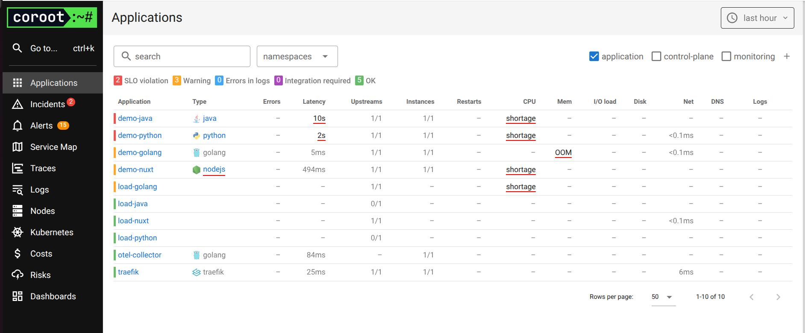

Что находится на странице `Applications` интуитивно понятно, но отметим пару моментов.

**`shortage` в колонке CPU** (подчёркнуто красным) — не «процент загрузки», а нехватка процессорного времени: сколько времени процессы ждали CPU, но не получали его. Причины — троттлинг по лимиту CPU либо конкуренция с другими контейнерами на ноде.

**Latency против Net** — это разные вещи. **Latency** — время ответа самого приложения на запросы клиентов (сколько ждут вызывающие стороны). **Net** — сетевой round-trip time на TCP-уровне между приложением и сервисами, от которых оно зависит: время обработки приложением в него не входит, измеряется только сетевая компонента. Поэтому `demo-golang` имеет Latency 5ms, но Net <0.1ms — приложение быстрое, сеть не задерживает.

### Incidents

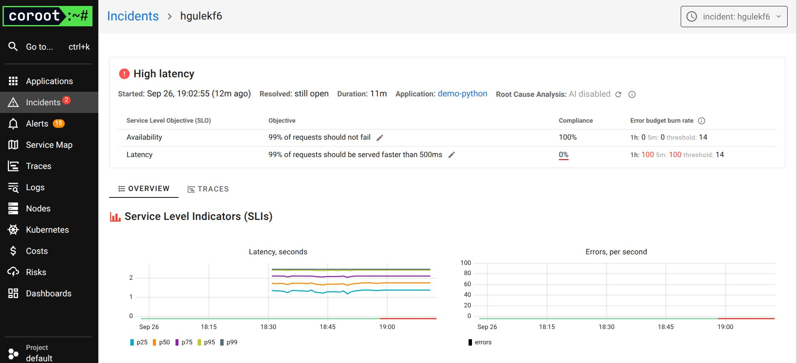

В Coroot управление инцидентами (Incidents) построено вокруг концепции SLO-based alerting (оповещений на основе целей уровня обслуживания). Вместо того чтобы засыпать инженера сотнями разрозненных алертов на каждый чих процессора, Coroot создает единый инцидент только тогда, когда приложение действительно "страдает" с точки зрения пользователя.

### Alerts

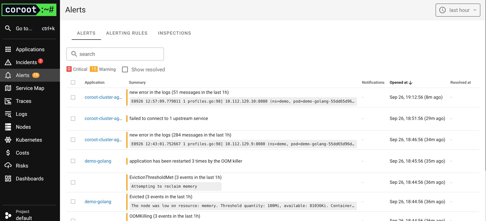

Встроенная система алертинга на базе преднастроенных алертов, которая автоматически выявляет проблемы в приложениях и инфраструктуре Kubernetes, помогая инженерам быстро находить первопричины сбоев. 

Алерты наружу — **Project Settings → Integrations**: Slack, Microsoft Teams, PagerDuty, Opsgenie, webhook. Маршрутизация по [категориям приложений](https://docs.coroot.com/configuration/application-categories#notification-routing) и типам событий: **Incidents**, **Deployments**, **Alerts**. Источники алертов: инспекции, новые паттерны в логах, Kubernetes-события, кастомный PromQL.


### Service Map

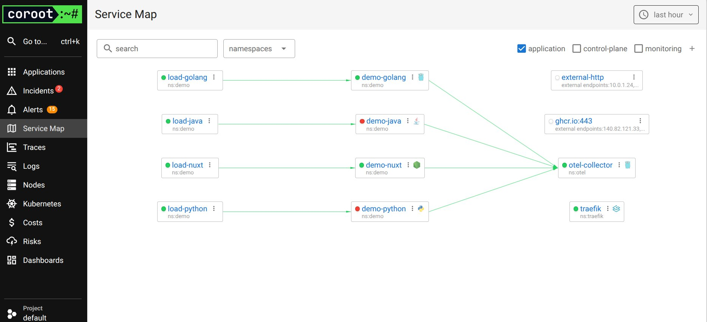

Service Map - инструмент автоматической визуализации связей между компонентами. Она строится без необходимости ручной настройки или изменения кода.

### Шаг 4. OpenTelemetry Collector

Скорее всего, у вас уже установлен **OpenTelemetry Collector**, поэтому конфигурируем отправку трейсов через него — он принимает трейсы от всех четырёх приложений по OTLP/HTTP (порт `4318`), батчит их и пересылает в Coroot. Конфигурация — в [otel-collector-values.yaml](otel-collector-values.yaml) в корне репозитория (используется `config` чарта `open-telemetry/opentelemetry-collector`, который сливается с дефолтным конфигом: ненужные дефолтные ресиверы jaeger/zipkin/prometheus и pipelines logs/metrics явно обнулены через `null`, остаётся только HTTP-ресивер трейсов).

Файл `otel-collector-values.yaml`:

```yaml
mode: deployment

# Короткое и предсказуемое имя ресурсов (иначе будет <release>-opentelemetry-collector).
fullnameOverride: otel-collector

image:
  repository: otel/opentelemetry-collector-contrib

config:
  receivers:
    otlp:
      protocols:
        http:
          endpoint: 0.0.0.0:4318

  exporters:
    otlp_http/coroot:
      endpoint: "http://coroot-coroot.coroot:8080"

  service:
    pipelines:
      # Дефолтные pipelines logs/metrics не нужны — глушим.
      logs: null
      metrics: null
      # traces сливается с дефолтным, поэтому список receivers переопределяем
      # целиком (без jaeger/zipkin) и меняем exporters на coroot.
      traces:
        receivers: [otlp]
        processors: [batch]
        exporters: [otlp_http/coroot]
```

Устанавливаем коллектор:

```bash
helm repo add open-telemetry https://open-telemetry.github.io/opentelemetry-helm-charts
helm install otel-collector open-telemetry/opentelemetry-collector \
  --version 0.173.1 -n otel --create-namespace -f otel-collector-values.yaml
```

Коллектор слушает OTLP/HTTP на `4318` в namespace `otel`. Приложения обращаются к нему по адресу `http://otel-collector.otel:4318/v1/traces`, а сам коллектор пересылает батчи в Coroot на внутренний сервис `coroot-coroot.coroot:8080`.

Обзор Tracing с установленными 4 demo приложениями. В разделе трассировок пять вкладок:

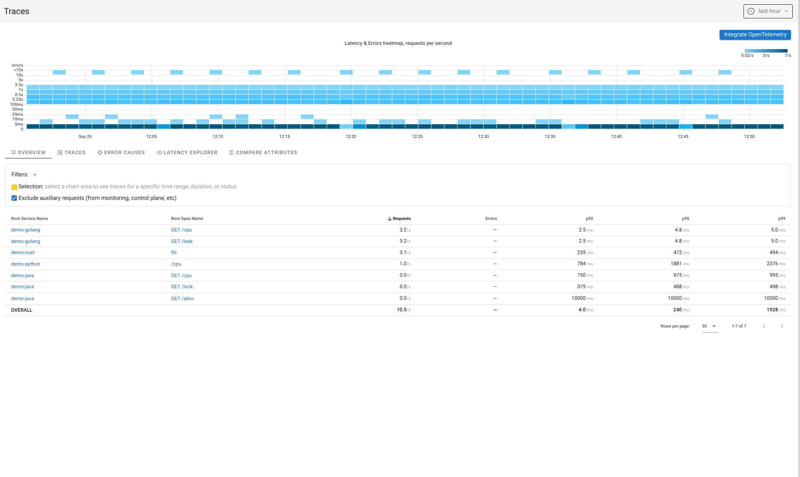

**OVERVIEW** — **HeatMap** распределения запросов во времени со статусами и длительностью. По тепловой карте сразу видны аномалии; выделив область, можно посмотреть входящие в неё трейсы.

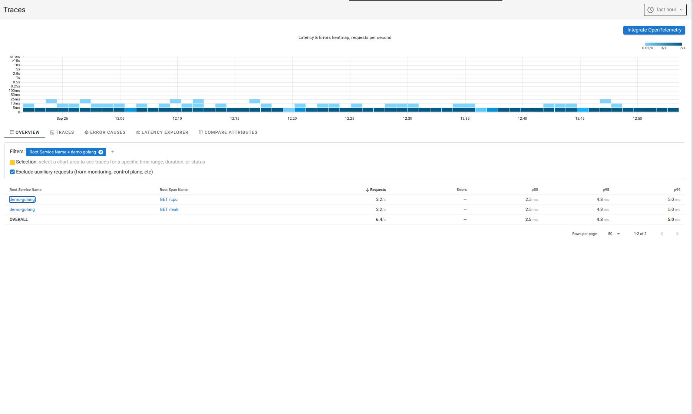

**TRACES** — просмотр отдельных трейсов по выделенной области: путь запроса по сервисам, спаны и их длительности.

**ERROR CAUSES** — автоматически анализирует **все** затронутые запросы в выделенной области и находит спаны с ошибками — одного ли типа все ошибки или происходят разные сбои одновременно.

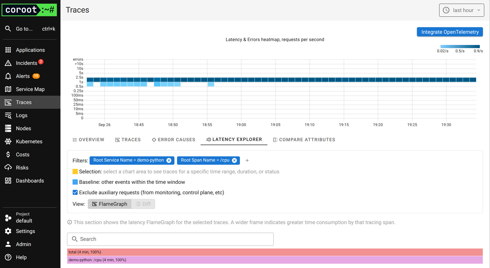

**LATENCY EXPLORER** — сравнивает длительность операций с остальными запросами; задержка визуализируется как latency-флеймграф, замедлившиеся операции подсвечиваются красным.

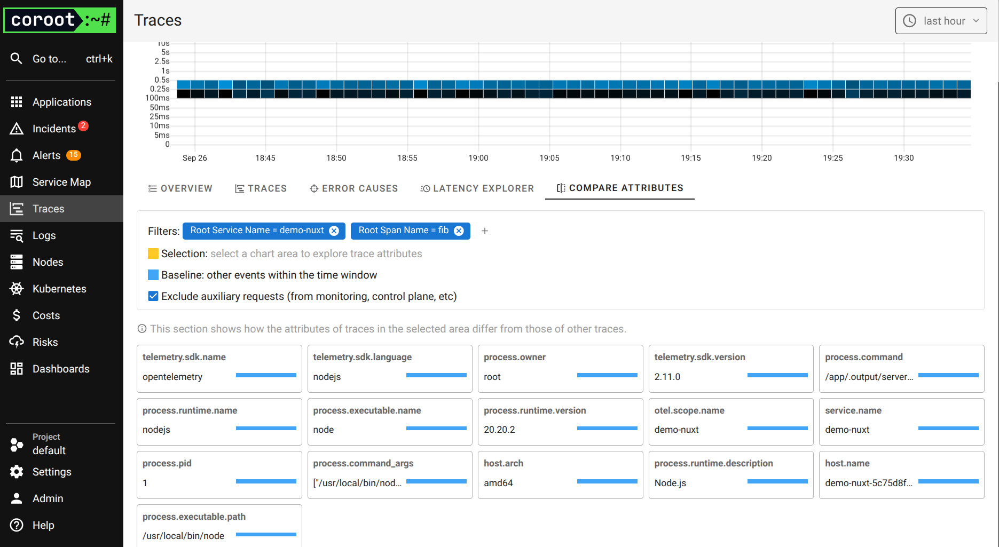

**COMPARE ATTRIBUTES** — сравнение атрибутов трасс внутри выделенной области с остальными запросами, полезно при разном поведении для конкретных клиентов, браузеров или feature flag.

## Часть 2. Четыре «сломанных» приложения

Чтобы продемонстрировать профилирование, задеплоим четыре приложения с намеренно внесёнными проблемами. Исходники — в каталоге [apps](apps), деплой — Helm-чартом [chart](chart). Вместе с приложениями чарт поднимает **генераторы нагрузки** — по одному Kubernetes Job на каждое включённое приложение.

### Обзор приложения и SLO

При открытии приложения Coroot показывает **SLO** (Service Level Objectives) — целевые показатели надёжности сервиса. По умолчанию отслеживаются два SLO: **Availability** (99% запросов должны быть обслужены без ошибок) и **Latency** (99% запросов должны обслуживаться быстрее 500 мс). Coroot считает SLI по eBPF-метрикам на уровне приложения и показывает фактическое соблюдение объектива, latency в виде гистограммы с фиксированными бакетами (5 мс — 10 с) и остаток error budget.

### Шаг 1. Nuxt (Node.js)

Приложение на Nuxt 3 с единственным API-эндпоинтом `/api/cpu`, который считает наивный Фибоначчи (`fib(35)` — ~30 млн рекурсивных вызовов). Экспоненциальная сложность мгновенно видна в CPU-профиле.

Ключевой момент — **символизация JS-фреймов**. eBPF-профилировщик снимает нативные стектрейсы, но без perf-map названия JS-функций не резолвятся. Node.js умеет генерировать perf-map сам, если запустить его с флагами.

Файл `chart/values.yaml` (фрагмент):

```yaml
nuxt:
  env:
    NODE_OPTIONS: "--perf-basic-prof-only-functions --interpreted-frames-native-stack"
```

Файл `apps/nuxt/Dockerfile` (фрагмент):

```dockerfile
ENV NODE_OPTIONS="--perf-basic-prof-only-functions --interpreted-frames-native-stack"
```

С этими флагами во флеймграфе будут реальные имена функций `fib`/`fib`, а не анонимные адреса.

Минимальная рабочая версия — **18.19+ / 20.10+ / 21.1+**.

**Трейсы** подключаются через OpenTelemetry: Nitro-плагин запускает `NodeSDK` с `HttpInstrumentation`, который на каждый запрос создаёт server-span, а в обработчике добавляется вложенный span `fib`.

Файл `apps/nuxt/server/plugins/otel.ts` (фрагмент):

```ts
export default defineNitroPlugin(() => {
  const sdk = new NodeSDK({
    instrumentations: [new HttpInstrumentation()],
  })
  sdk.start()
})
```

Экспорт — в OpenTelemetry Collector через OTLP.

Файл `chart/values.yaml` (фрагмент):

```yaml
nuxt:
  env:
    OTEL_SERVICE_NAME: "demo-nuxt"
    OTEL_EXPORTER_OTLP_TRACES_ENDPOINT: "http://otel-collector.otel:4318/v1/traces"
    OTEL_EXPORTER_OTLP_TRACES_PROTOCOL: "http/protobuf"
```

#### Что видно в Coroot

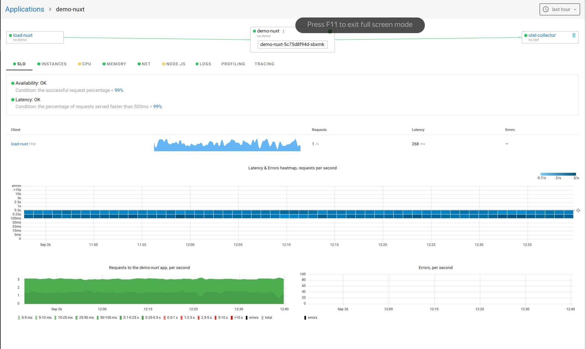

На overview-slo видно соблюдение двух SLO (Availability и Latency), остаток error budget и гистограмму latency с фиксированными бакетами.

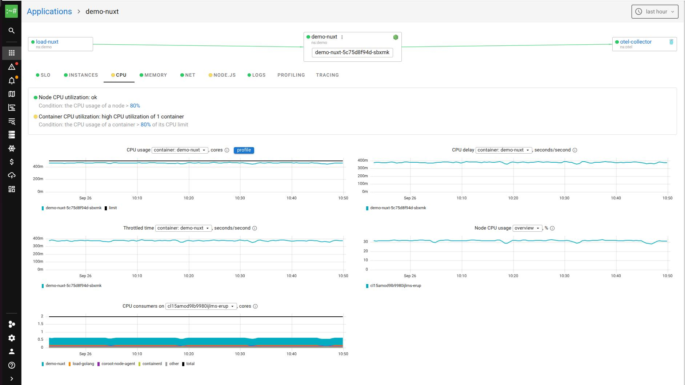

Инспекция CPU выводит две проверки: **Node CPU utilization** — `ok` (загрузка ноды ниже порога 80%), и **Container CPU utilization** — `high CPU utilization of 1 container`: контейнер `demo-nuxt` превышает 80% своего CPU-лимита.

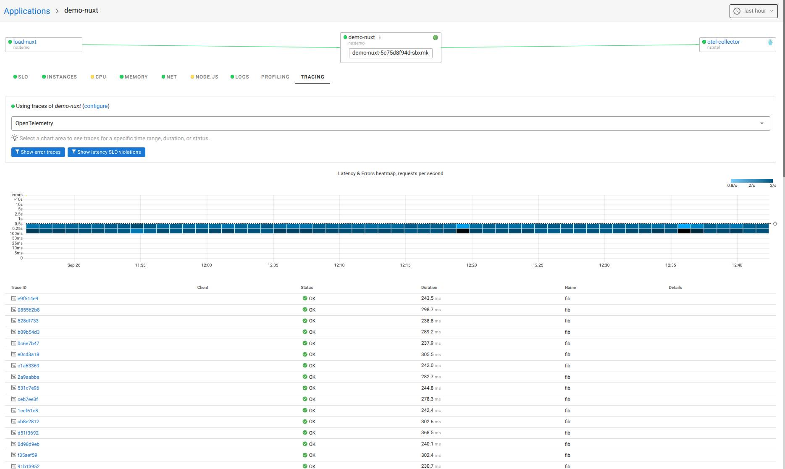

На вкладке **Tracing** у `demo-nuxt` — server-span на каждый `/api/cpu` и вложенный span `fib`. Из аномалии CPU — во флеймграф (`fib` благодаря perf-map), из медленного span'а — в логи и профили.

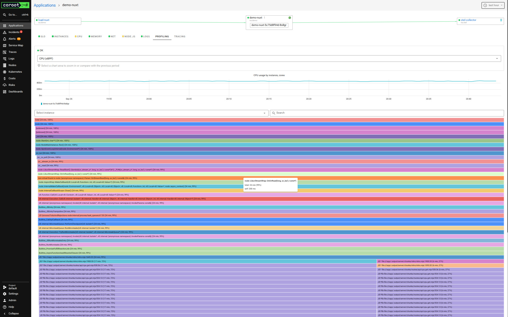

На скриншоте представлен интерфейс платформы мониторинга Coroot, где открыта вкладка Profiling для инспектирования Nuxt-приложения (demo-nuxt). В верхней части экрана расположен график загрузки процессора (CPU usage by instance, cores), полученный с помощью eBPF-профилирования, который показывает стабильное и относительно низкое потребление ресурсов во времени. Ниже отображается подробная пламенная диаграмма (Flame Graph) с цветовым разделением различных инстансов и функций, где один из элементов наведен курсором мыши, вызывая всплывающее окно с детальной метрикой выполнения конкретной функции (modern...) — в частности, указано время работы процессора (33 ms, 16%) и общее системное время (407 ms).


### Шаг 2. Python

Python-приложение на стандартном `http.server` с эндпоинтом `/cpu`: наивный `fib(30)` плюс busy-loop с `math.sqrt`. eBPF-профилировщик Coroot снимает CPU-профиль Python-процесса без каких-либо агентов и изменений кода, а Pyroscope eBPF-профайлер резолвит Python-фреймы, так что во флеймграфе виден именно `naive_fib`.

**Трейсы** — автоинструментация OpenTelemetry: приложение запускается через `opentelemetry-instrument`, который сам инструментирует `http.server` и экспортирует server-span'ы в OpenTelemetry Collector через OTLP. В `app.py` обработчик дополнительно оборачивается во вложенный span через `trace.get_tracer(...)`.

Файл `apps/python/app.py` (фрагмент):

```python
from opentelemetry import trace

tracer = trace.get_tracer("demo-python")


class Handler(BaseHTTPRequestHandler):
    def do_GET(self):
        with tracer.start_as_current_span(self.path):
            ...
```

Файл `apps/python/Dockerfile` (фрагмент):

```dockerfile
CMD ["opentelemetry-instrument", "--traces_exporter", "otlp_proto_http", "--metrics_exporter", "none", "--logs_exporter", "none", "python", "app.py"]
```

Файл `chart/values.yaml` — тот же фрагмент, что для Nuxt, только `OTEL_SERVICE_NAME: "demo-python"`.

#### Что видно в Coroot

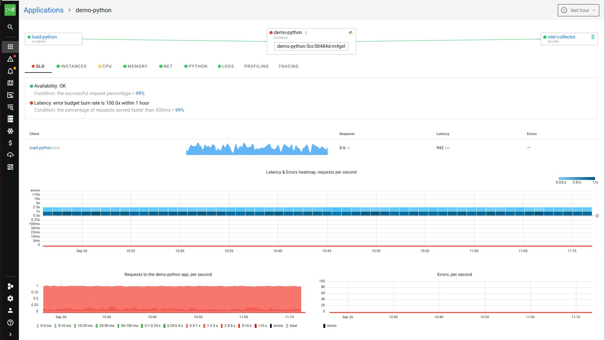

На overview-slo видно соблюдение двух SLO (Availability и Latency), остаток error budget и гистограмму latency; вызов `/cpu` с наивным `fib(30)` и busy-loop выходит за предел в 500 мс.

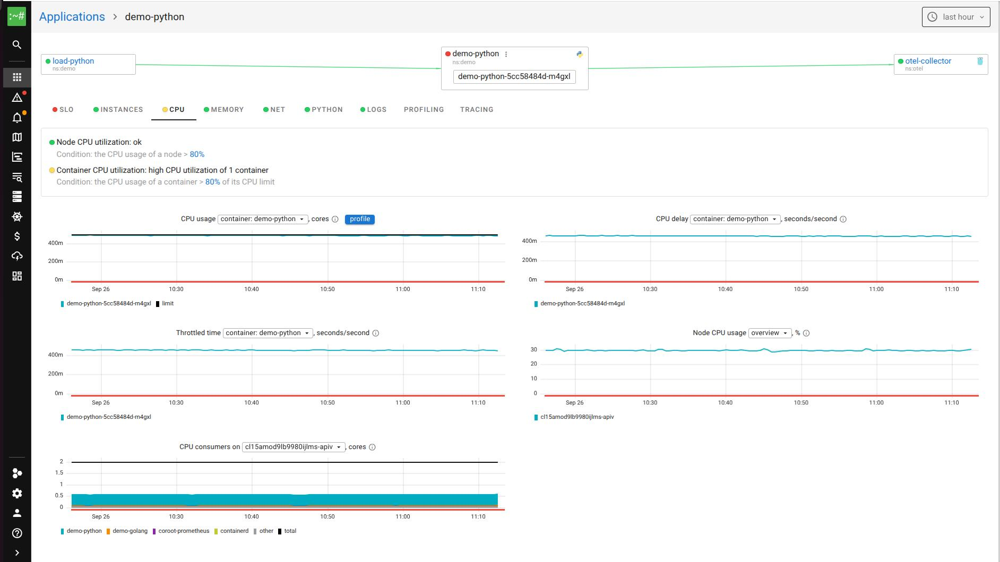

На вкладке **Tracing** у `demo-python` — server-span от автоинструментации `http.server` и вложенный span `/cpu`. Из аномалии CPU — во флеймграф `naive_fib`, из медленного span'а — в логи и профили.

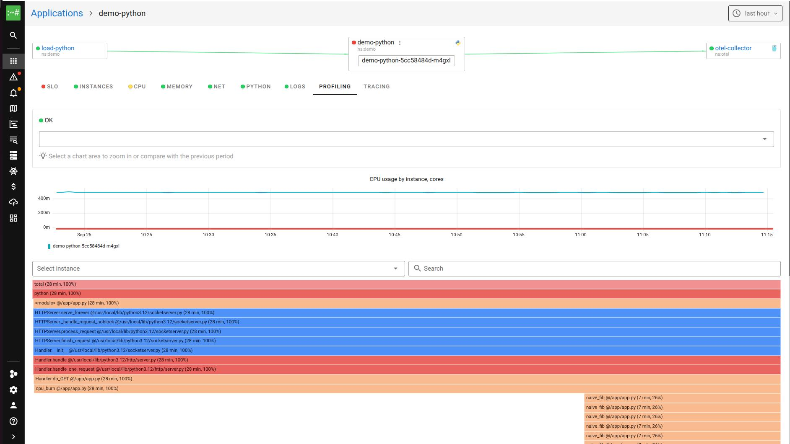

Флеймграф **Profiling** за выбранный интервал покажет CPU в `naive_fib` и в busy-loop с `math.sqrt`; режим **Comparison** подсветит красным функции, которые стали есть больше CPU относительно прошлого интервала.

### Шаг 3. Golang

Go-приложение с тремя проблемами сразу:

- **утечка памяти** — фоновый цикл каждую секунду добавляет 1 MiB в слайс, который никогда не освобождается (лимит пода 2 GiB). Генератор нагрузки ещё дергает `/leak`, поэтому растут и горутины — под упирается в память и перезапускается
- **утечка горутин** — эндпоинт `/leak` запускает горутину, которая блокируется навсегда
- **CPU-нагрузка** — эндпоинт `/cpu` с бесполезным циклом на 5 млн итераций

Для Go Coroot собирает профили **по трём каналам**, которые частично пересекаются:

| Тип профиля | eBPF (node-agent) | Go heap-профайлер (node-agent, `/proc/<pid>/mem`) | pprof-скрейп (cluster-agent, `/debug/pprof`) |
|---|---|---|---|
| CPU | ✅ все процессы, любой язык | ❌ | ✅ `/debug/pprof/profile` |
| heap / Memory | ❌ | ✅ `Go Memory` (alloc/inuse × space/objects) | ✅ `Memory` (те же данные, дубль) |
| blocking | ❌ | ❌ | ✅ `/debug/pprof/block` |
| mutex | ❌ | ❌ | ✅ `/debug/pprof/mutex` |
| goroutine | ❌ | ❌ | ✅ `/debug/pprof/goroutine` |

Что именно включать — зависит от того, какие профили нужны:

| Нужны профили | Что делать | Изменения в коде |
|---|---|---|
| heap / CPU | ничего: `Go Memory` собирает node-agent из коробки, CPU — eBPF | не нужны |
| blocking / mutex / goroutine | eBPF их не даёт — нужен pprof-скрейп (`/debug/pprof`), а `--go-heap-profiler=disabled` уберёт дублирующие `Go Memory` | `import _ "net/http/pprof"` + аннотации пода |

То есть для heap и CPU Go-приложение не требует ни правки кода, ни `profile-scrape` — оба канала работают извне (eBPF + чтение `/proc/<pid>/mem`). pprof-скрейп нужен только ради профилей, которых нет в eBPF: blocking, mutex и goroutine.

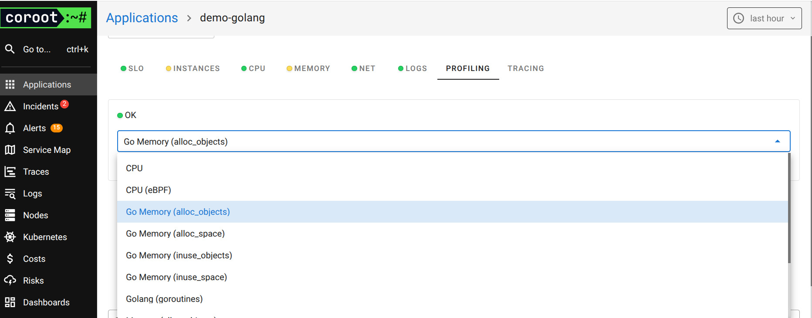

Файл `chart/values.yaml` (фрагмент):

```yaml
golang:
  podAnnotations:
    coroot.com/profile-scrape: "true"
    coroot.com/profile-port: "8080"
```

Сам код подключает `net/http/pprof` одной строкой:

```go
import _ "net/http/pprof"
```

**Трейсы** — ручное инструментирование OpenTelemetry (автоинструментации для Go в Coroot нет): маршрутизатор оборачивается в `otelhttp.NewHandler`, а OTLP-экспортер читает endpoint из env и шлёт спаны в OpenTelemetry Collector. Каждый входящий запрос на `/cpu` и `/leak` становится трейсом в Coroot.

Файл `apps/golang/main.go` (фрагмент):

```go
exporter, err := otlptrace.New(ctx, otlptracehttp.NewClient())
// ...
handler := otelhttp.NewHandler(http.DefaultServeMux, "http-server")
```

Зависимости OpenTelemetry требуют Go **1.25+**.

Файл `apps/golang/Dockerfile` (фрагмент):

```dockerfile
FROM golang:1.25-alpine AS build
```

Файл `chart/values.yaml` (фрагмент):

```yaml
golang:
  env:
    OTEL_SERVICE_NAME: "demo-golang"
    OTEL_EXPORTER_OTLP_TRACES_ENDPOINT: "http://otel-collector.otel:4318/v1/traces"
    OTEL_EXPORTER_OTLP_TRACES_PROTOCOL: "http/protobuf"
```

Memory-профиль показывает устойчивый рост `alloc_space`: куча растёт на ~1 MiB/сек за счёт фонового `growLeak`. Флеймграф memory-профиля указывает точное место — `main.growLeak`, где происходит `append` в `leakBuf`.

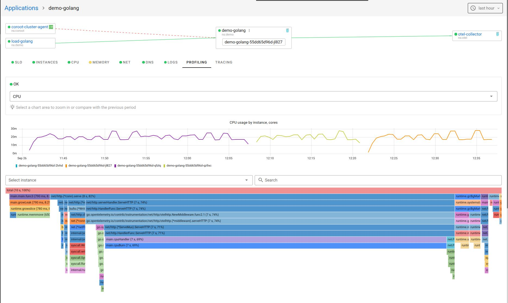

Горутины-утечки видны косвенно: число горутин растёт (`/healthz` отдаёт `runtime.NumGoroutine()`), а Coroot связывает это с ростом потребления и деградацией SLO.

#### Что видно в Coroot

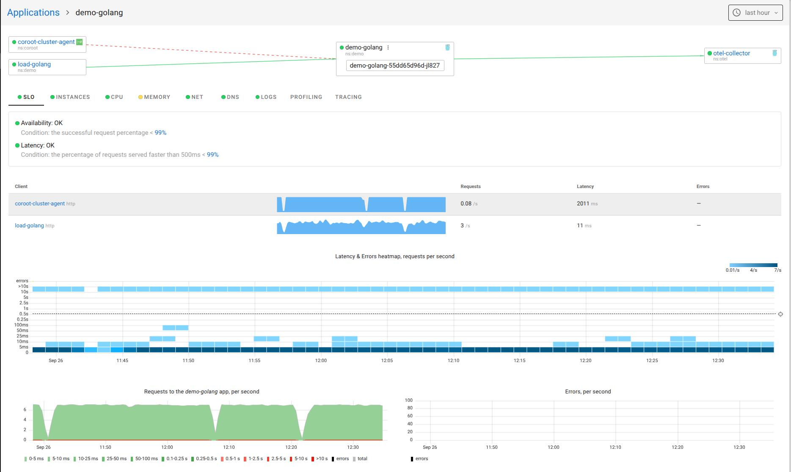

На overview-slo видно, как рост памяти и утечка горутин деградируют соблюдение двух SLO (Availability и Latency); вызовы `/cpu` и `/leak` уходят за objective 500 мс.

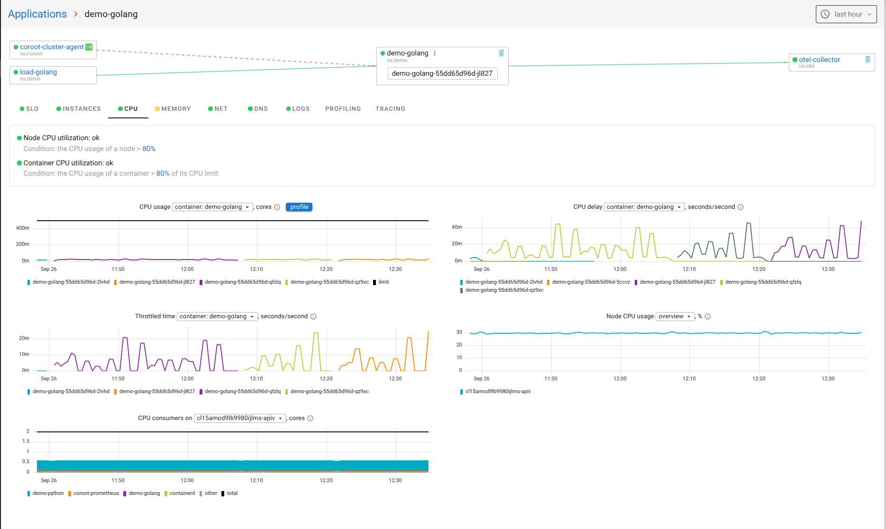

На вкладке **Tracing** — server-span на каждый `/cpu` и `/leak` (`otelhttp.NewHandler`). HeatMap и выделение области — как в Шаге 1. Из аномалии CPU — во флеймграф, из медленного span'а — в логи и профили, в том числе heap: `main.growLeak`.

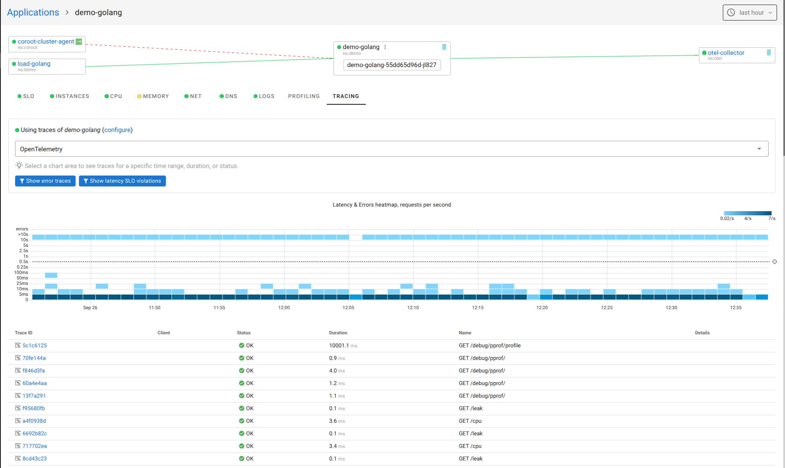

### Шаг 4. Java

- **Java-профилирование** включается флагом `ENABLE_JAVA_ASYNC_PROFILER=true` в `coroot-values.yaml` (см. Шаг 1). Java-агент для профилирования не нужен — `coroot-node-agent` сам находит HotSpot JVM по `libjvm.so` в `/proc/<pid>/maps` и подгружает async-profiler через JVM Attach API. (Java-агент в [apps/java/Dockerfile](apps/java/Dockerfile) — это OpenTelemetry-инструментация для трейсов, к профилированию отношения не имеет.)

Java-приложение на встроенном `com.sun.net.httpserver` с тремя эндпоинтами:

- **`/cpu`** — наивный `fib(35)` плюс цикл на 5 млн итераций
- **`/alloc`** — фоновая аллокация массивов (видна в Memory-профиле как `alloc_space`/`alloc_objects`)
- **`/lock`** — два потока намеренно конкурируют за один монитор (`synchronized` + `sleep`), создавая Lock-профиль

JVM-флаги для профилирования **не обязательны**, но желательны. Async-profiler подгружается в JVM **динамически** (через JVM Attach API), а не через `-agentpath`, поэтому часть JIT-скомпилированного до attach кода не имеет debug-информации и попадает во флеймграфе в `[unknown]`. Чтобы минимизировать потери, приложение запускается с флагами:

Файл `apps/java/Dockerfile` (фрагмент):

```dockerfile
ENTRYPOINT ["java", \
  "-javaagent:/app/opentelemetry-javaagent.jar", \
  "-XX:+UnlockDiagnosticVMOptions", \
  "-XX:+DebugNonSafepoints", \
  "-XX:+PreserveFramePointer", \
  "-XX:TieredStopAtLevel=1", \
  "-XX:CompileCommand=dontinline,DemoJava.naiveFib", \
  "-cp", "/app", "DemoJava"]
```

`-XX:+UnlockDiagnosticVMOptions` разблокирует диагностические опции — без него JVM не примет `-XX:+DebugNonSafepoints`. `-XX:+DebugNonSafepoints` заставляет JIT сохранять debug-информацию и в несейфпоинтах, `-XX:+PreserveFramePointer` сохраняет frame pointer (улучшает резолв и для eBPF-профилировщика). Полностью убрать `[unknown]` всё равно нельзя: на горячих методах (`naiveFib`), скомпилированных до подключения агента, дебаг-инфо появится только после перекомпиляции.

**Трейсы** — автоматическая инструментация через OpenTelemetry Java-агент: jar скачивается в образе и подключается флагом `-javaagent`, так что менять код не нужно — спаны HTTP-запросов генерируются автоматически и уходят в OpenTelemetry Collector через OTLP.

Файл `apps/java/Dockerfile` (фрагмент):

```dockerfile
RUN wget -q -O /opentelemetry-javaagent.jar \
      https://github.com/open-telemetry/opentelemetry-java-instrumentation/releases/latest/download/opentelemetry-javaagent.jar
```

Файл `chart/values.yaml` — тот же фрагмент, что для Nuxt, только `OTEL_SERVICE_NAME: "demo-java"`.

Для `demo-java` Coroot показывает сразу несколько типов профилей из async-profiler:

- **CPU** — почти всё время в `naiveFib` (рекурсия с экспоненциальной сложностью), как и у Python/Node.js, но с нативными Java-фреймами
- **Memory** — рост `alloc_space`/`alloc_objects` по стеку аллокаций в `DemoJava.allocate`
- **Lock** — время ожидания монитора (`delay`) и число контеншенов (`contentions`) на `synchronized`-блоке

Рядом с профилями async-profiler экспортирует одноимённые метрики (`container_jvm_alloc_bytes_total`, `container_jvm_lock_contentions_total`, `container_jvm_profiling_status` и др.) — по ним удобно ловить аномалии на графике и проваливаться в флеймграф.

#### Что видно в Coroot

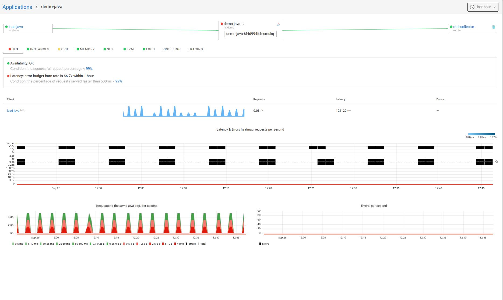

На overview-slo видно соблюдение двух SLO (Availability и Latency), остаток error budget и гистограмму latency; вызов `/cpu` с наивным `fib(35)` уходит далеко за objective 500 мс, а `/alloc` даёт рост потребления памяти.

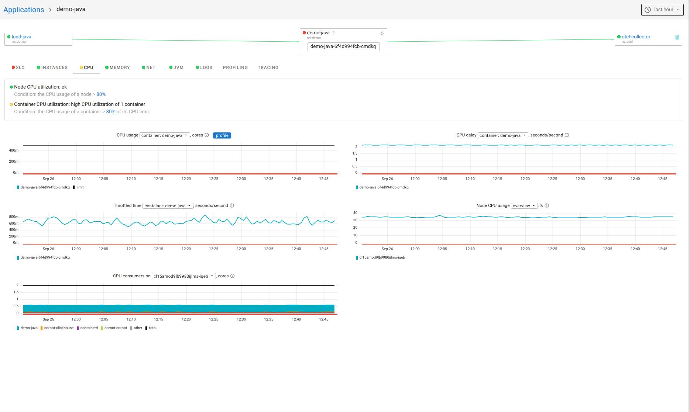

На вкладке **Profiling** async-profiler отдаёт сразу несколько типов профилей: **CPU** (почти всё время в `naiveFib`), **Memory** (рост `alloc_space`/`alloc_objects` по стеку аллокаций в `DemoJava.allocate`) и **Lock** (время ожидания монитора и число контеншенов на `synchronized`-блоке).

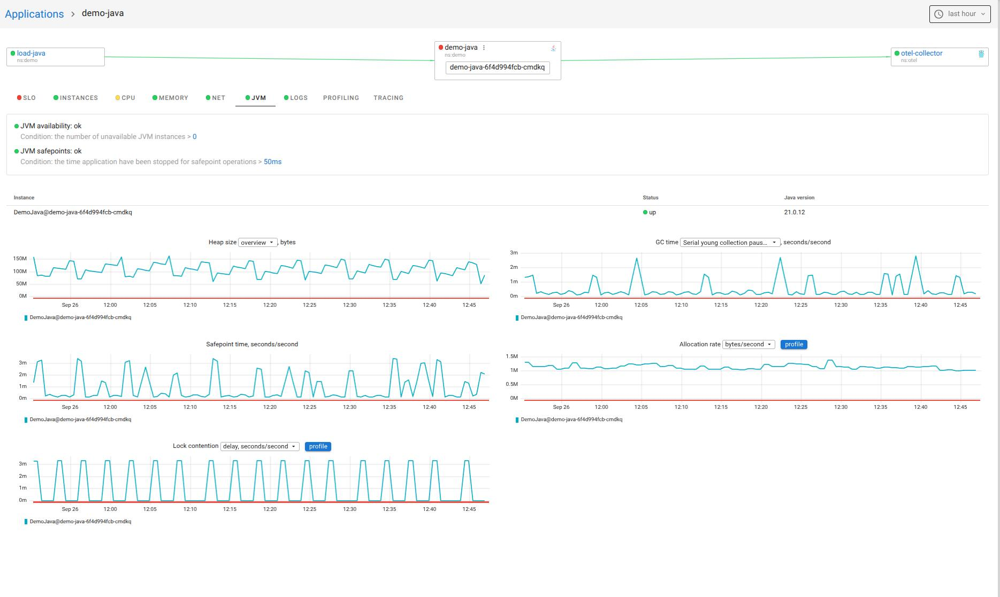

На вкладке **Tracing** — server-span на каждый запрос (OTel Java-агент, без изменений кода). От аномалии CPU — во флеймграф `naiveFib`, от роста alloc — в Memory-профиль, из медленного span'а — в логи и профили.

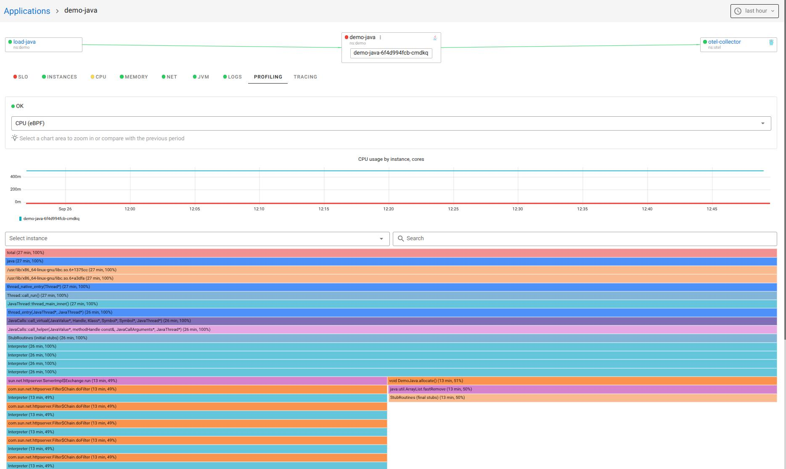

## Масштабирование и обновление

### Реплики и ClickHouse

Для продакшена имеет смысл `clickhouse.shards/replicas: 2` и `keeper.replicas: 3` (по умолчанию), а также несколько реплик Coroot (`replicas: 2`), для чего потребуется вынести конфигурацию из SQLite в PostgreSQL (`postgres.*` в CR).

## Заключение

Coroot закрывает главный пробел классического мониторинга — вопрос «*почему* медленно». Непрерывное eBPF-профилирование снимает CPU-профили без единой строки кода, языковые профилировщики добавляют память и блокировки, а предустановленные инспекции автоматически находят типовые проблемы. Всё это — с метриками, логами и трейсами в одном UI.

Ключевые преимущества:

- **Zero-instrumentation** — eBPF снимает CPU-профили всех процессов без изменений в коде
- **Флеймграф до строки кода** — CPU и память в один клик, сравнение с базовой линией
- **Встроенная экспертиза** — инспекции находят ~80% типовых проблем автоматически
- **Все сигналы в одном месте** — метрики, логи, трейсы и профили связаны между собой
- **Простота развёртывания** — один Helm-чарт coroot-operator управляет всем стеком

Полезные ссылки:

- GitHub: [github.com/coroot/coroot](https://github.com/coroot/coroot)
- Документация: [docs.coroot.com](https://docs.coroot.com/)
- Helm-чарты (OCI): [ghcr.io/coroot/charts](https://github.com/coroot/coroot-operator/pkgs/container/charts%2Fcoroot-operator)
- Operator: [github.com/coroot/coroot-operator](https://github.com/coroot/coroot-operator)
- Live demo: [demo.coroot.com](https://demo.coroot.com/)
